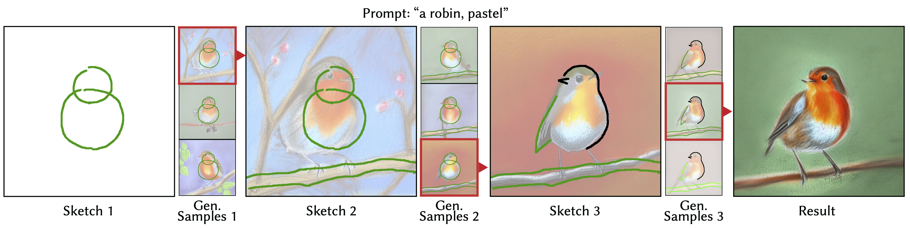
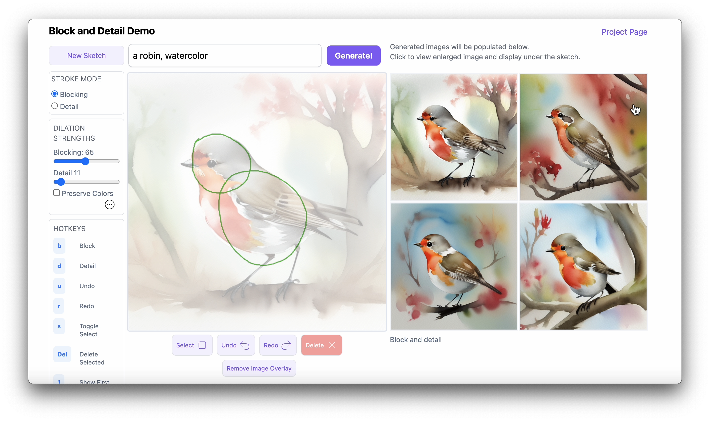
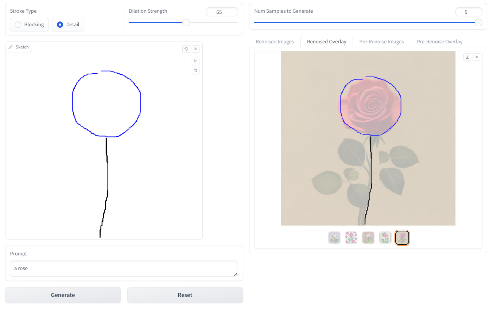

# Block and Detail: Scaffolding Sketch-to-Image Generation (UIST 2024)

> **Vishnu Sarukkai, Lu Yuan\*, Mia Tang\*, Maneesh Agrawala, Kayvon Fatahalian**
>
> We introduce a novel sketch-to-image tool that aligns with the iterative refinement process of artists. Our tool lets users sketch blocking strokes to coarsely represent the placement and form of objects and detail strokes to refine their shape and silhouettes. We develop a two-pass algorithm for generating high-fidelity images from such sketches at any point in the iterative process. In the first pass we use a ControlNet to generate an image that strictly follows all the strokes (blocking and detail) and in the second pass we add variation by renoising regions surrounding blocking strokes.

<a href="https://miatang13.github.io/BlockAndDetail/"></a>
<a href="https://arxiv.org/abs/2402.18116"></a>



## Description

Official implementation of our Block and Detail paper.

## Environment Setup

Create and activate our environment with the following command.

```bash
conda env create -f environment.yml
conda activate bad
```

## Download Model

We have prepared a bash script that takes care of downloading our pretrained `PartialSketchControlNet` from huggingface. Please run this command from the root of this project.

```bash
# Makes a new folder and downloads the model info
bash download_model.sh
```

You can also manually download the model files from [Hugging Face](https://huggingface.co/datasets/miamia333/BlockAndDetail/tree/main) and place the `.json` and `.safetensors` files in a `partialsketchcontrolnet` folder.

## Usage - Custom Interface

To run the interface, run the following commands.

```bash
cd Block-and-Detail/interface
CUDA_VISIBLE_DEVICES=<available_gpu_ids> python app.py --port=<port_id>
```



## Usage - Gradio Demo

We also offer a gradio demo, but this demo is limited in functionality compared to our interface.  
To run the gradio demo, run the following commands:

```bash
cd Block-and-Detail
python run_gradio.py
```



## Data Generation

To generate training data for partial sketch ControlNet, we need foreground object masks and svg files of the extracted synthetic "sketches" of the target images.
We used scripts from [CLIPascene](https://github.com/yael-vinker/SceneSketch) for foreground object mask extraction and [VirtualSketching](https://github.com/MarkMoHR/virtual_sketching) for svg file generation.
Then run our data generation script for training partial sketch generation.

```bash
python make_data.py --mask_path=MASK_PATH --svg_path=SVG_PATH
```

## Acknowledgements

This repository is partially based on [Diffusers](https://github.com/huggingface/diffusers) and [Collage Diffusion](https://github.com/VSAnimator/collage-diffusion).

## Citation

If you use this code for your research, please cite the following work:

```
@inproceedings{10.1145/3654777.3676444,
    author = {Sarukkai, Vishnu and Yuan, Lu and Tang, Mia and Agrawala, Maneesh and Fatahalian, Kayvon},
    title = {Block and Detail: Scaffolding Sketch-to-Image Generation},
    year = {2024},
    isbn = {9798400706288},
    publisher = {Association for Computing Machinery},
    address = {New York, NY, USA},
    url = {https://doi.org/10.1145/3654777.3676444},
    doi = {10.1145/3654777.3676444},
    articleno = {33},
    numpages = {13},
    location = {Pittsburgh, PA, USA},
    series = {UIST '24}
}
```
